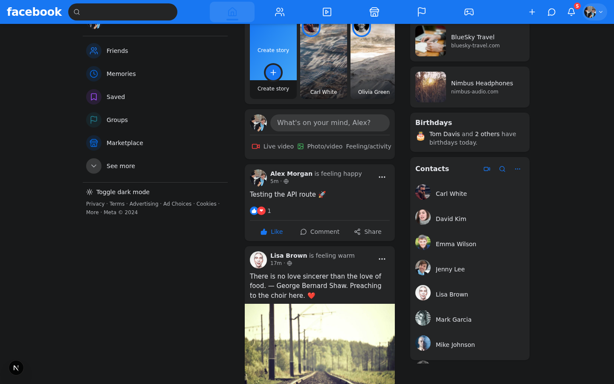
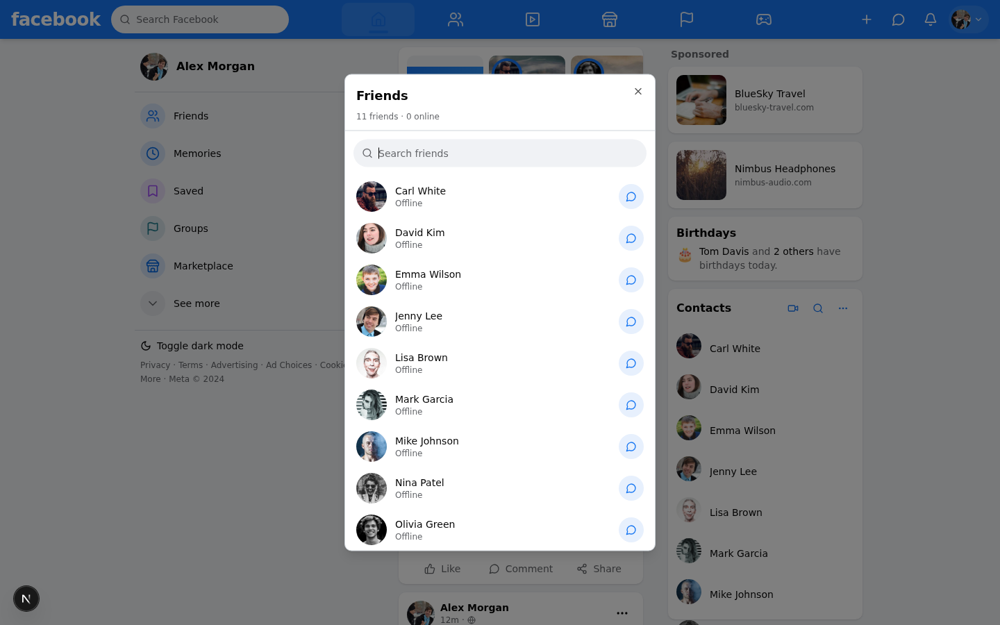

# Facebook Clone

A full-featured Facebook clone built with **Next.js 16**, **React 19**, **TypeScript**, **Tailwind CSS 4**, and **shadcn/ui** (New York style).

> Connect with friends and the world around you — with a real news feed, stories, likes, comments, real-time chat, and notifications.

---

## Screenshots

| Login | Register | Feed |
|-------|----------|------|
|  |  |  |

---

## Tech Stack

| Layer | Technology |
|-------|------------|
| Framework | Next.js 16 (App Router, standalone output) |
| Language | TypeScript, React 19 |
| Styling | Tailwind CSS 4 + shadcn/ui (New York) + Radix UI primitives |
| Database | Prisma ORM + SQLite (`db/custom.db`) |
| Auth | NextAuth.js v4 — Credentials provider + bcryptjs (JWT, 30-day sessions) |
| State | Zustand (chat/store), TanStack Query v5 (server state), React Hook Form + Zod |
| Real-time | Socket.IO (mini-service on port 3003) |
| Animations | Framer Motion |
| Icons | Lucide React |
| Toasts | Sonner |
| Dates | date-fns |
| Drag & drop | @dnd-kit |
| Charts | Recharts |
| Markdown | MDXEditor + react-markdown + react-syntax-highlighter |
| Image processing | Sharp |
| Logging | pino-style (Prisma query log to stdout) |

---

## Features

### Authentication
- **Register** — first name, last name, email, password (≥6 chars), bcrypt-hashed, auto-friends with 5 existing users.
- **Login** — email + password via NextAuth Credentials provider.
- **Logout** — NextAuth sign-out, redirects to `/` (AuthScreen).
- **Session** — JWT, 30-day expiry; user id exposed on session.
- **Protected APIs** — all routes return `401` when unauthenticated.

### News Feed
- Stories carousel (horizontal scroll, 5-second auto-advance, tap/arrow nav).
- Create-post box ("What's on your mind?") with Live / Photo / Feeling options.
- Post composer dialog: textarea, image picker (5 samples), feeling picker (10 options).
- Post cards: author avatar + name + feeling + relative time + globe + ⋯ menu.
- Like / Comment / Share action bar — thumbs-up turns blue when liked (optimistic update).
- Expandable comments section with avatars, pill input, Enter-to-send, Shift+Enter newline.
- Skeleton loading + empty/error states.

### Stories
- Horizontal scrollable story tiles with user avatars.
- "Create story" tile (gradient + Plus icon — no-op, composer coming soon).
- Full-bleed story viewer dialog: progress bars, caption overlay, X to close.

### Profile
- Full-screen profile modal: cover image + 120px avatar + name + post/friend counts.
- Message / Add Friend buttons.
- Bio, work, education, location.
- Recent posts grid (reuses PostCard).

### Search
- Blue header search field opens a popover with debounced results.
- Searches by name / first name / last name (excludes current user), takes 20.
- Clicking a result opens the profile modal.

### Notifications
- Bell icon with unread badge.
- Popover lists items with avatar + emoji type icon + text + relative time + blue dot if unread.
- Marks all as read on open; "See all" footer.

### Account Menu
- Avatar + chevron dropdown: Profile, Settings & Privacy, Log Out.
- Dark mode toggle (next-themes) inside the menu.
- Settings dialog: dark mode switch, notifications, privacy, about, log out (real NextAuth signout).

### Friends
- Friends dialog: friend count + online count, search box, each friend shows avatar + online status + Message button (opens chat).

### Chat (Real-time)
- **Socket.IO mini-service** on port 3003 (independent Bun project at `mini-services/chat-service/`).
- Chat dock: fixed bottom-right row of conversation windows.
- Message persistence via `POST /api/messages`; live relay via socket `private-message` event.
- Typing indicator dots; read receipts; time separators every 5 min.
- Minimized state: just the avatar with online dot.
- Online presence broadcast (`online-users` socket event).

### Sidebar & Navigation
- **Left sidebar**: user card (opens profile), 8 colored menu items (Friends / Memories / Saved / Groups / Marketplace / Watch / Events / Gaming), "See more" toggle, dark mode toggle + Meta copyright footer.
- **Right sidebar**: Sponsored (2 ad cards), Birthdays card, Contacts card (online-first list, video/search/more buttons).
- **Header**: sticky `#1877F2` blue bar. Left: menu (mobile) + "facebook" wordmark + search. Center: circular nav (Home, Friends, Watch, Marketplace, Groups, Gaming) with active blue underline. Right: Create menu, Messenger dropdown, Notifications, Account menu. Mobile: sheet nav.

### Dark Mode
- Full dark theme: cards `#242526`, text `#e4e6eb`, popovers/dropdowns/dialogs auto-theme via shadcn `.dark` variant.
- Header stays Facebook blue in both modes.
- Toggle in left sidebar footer + header account menu.

### Mobile
- Header collapses to Menu + Search buttons.
- Feed only; left sidebar → Sheet from menu button; right sidebar hides.
- Chat dock windows scroll horizontally.
- Touch targets ≥40px.

---

## Project Structure

```
.
├── prisma/
│   ├── schema.prisma      # User, Post, Comment, Like, Friendship,
│   │                      # Message, Notification, Story
│   └── seed.ts            # 12 realistic users + friendships + posts + stories
├── mini-services/
│   └── chat-service/      # Socket.IO server (port 3003)
├── src/
│   ├── app/
│   │   ├── layout.tsx     # Geist fonts, global CSS, Providers, SonnerToaster
│   │   ├── page.tsx       # useSession gate → AuthScreen | AppShell
│   │   ├── providers.tsx  # ThemeProvider, QueryClientProvider, SessionProvider, SocketBoot
│   │   └── api/
│   │       ├── me/               # GET — current user
│   │       ├── feed/             # GET — stories + posts (30, desc)
│   │       ├── posts/            # GET + POST — list / create
│   │       ├── posts/[id]/like  # POST — toggle like (optimistic)
│   │       ├── posts/[id]/comments  # GET + POST — list / create + notification
│   │       ├── contacts/        # GET — ACCEPTED friendships both dirs
│   │       ├── users/           # GET — search q=
│   │       ├── users/[id]/      # GET — full profile + counts + recent posts
│   │       ├── notifications/   # GET — newest first; POST /read — mark all read
│   │       ├── messages/        # GET (mark read + return convo) + POST (persist)
│   │       ├── stories/         # GET — all stories with user
│   │       └── auth/
│   │           ├── register/    # POST — validate + hash + create + auto-friend
│   │           └── [...nextauth]/  # NextAuth handler (GET + POST)
│   ├── components/fb/     # all Facebook components (use client)
│   │   ├── auth-screen.tsx    # full-screen login + register views
│   │   ├── app-shell.tsx      # header + sidebars + feed + chat + dialogs
│   │   ├── header.tsx
│   │   ├── left-sidebar.tsx
│   │   ├── right-sidebar.tsx
│   │   ├── feed.tsx
│   │   ├── post-card.tsx
│   │   ├── create-post.tsx
│   │   ├── stories.tsx
│   │   ├── story-viewer.tsx
│   │   ├── notifications.tsx
│   │   ├── search-palette.tsx
│   │   ├── account-menu.tsx
│   │   ├── user-avatar.tsx
│   │   ├── online-dot.tsx
│   │   ├── profile-modal.tsx
│   │   ├── chat-window.tsx
│   │   ├── chat-dock.tsx
│   │   ├── settings-dialog.tsx
│   │   └── friends-dialog.tsx
│   ├── lib/
│   │   ├── db.ts           # Prisma client (SQLite, query log)
│   │   ├── auth.ts         # getCurrentUser() from getServerSession
│   │   ├── auth.config.ts  # NextAuth options
│   │   ├── socket.ts       # singleton socket.io client
│   │   ├── store.ts        # Zustand: openWindows, online, typingFrom, profileTarget, storyInitialIndex
│   │   ├── format.ts       # formatRelative, formatFull, pluralize, initials, compact
│   │   ├── hooks/queries.ts  # TanStack Query hooks
│   │   └── utils.ts
│   └── hooks/
│       ├── use-mobile.ts
│       └── use-toast.ts
├── tailwind.config.ts
├── next.config.ts          # standalone output, typescript:ignoreBuildErrors
├── tsconfig.json
├── package.json
└── worklog.md             # full build history
```

---

## Getting Started

### Prerequisites

- **Bun** — package manager and runtime.
- **Node.js** ≥ 18 (Bun runtime).

### 1. Install dependencies

```bash
bun install
```

### 2. Push the database schema

```bash
bun run db:push
```

This creates `db/custom.db` (SQLite) and runs Prisma migrations.

### 3. Seed the database

```bash
bun run db:generate   # generate Prisma client (only once after schema change)
npx tsx prisma/seed.ts
```

The seed creates 12 realistic users, friendships (first user "me" friends with all), 16 posts with picsum images + feelings, likes, comments, stories, message history, and notifications.

> **Note:** Seeded users have `password = null` — they are the existing "community" visible in feed/contacts. Only newly registered users can log in.

### 4. Start the chat mini-service

```bash
cd mini-services/chat-service
bun run index.ts
```

The chat service listens on port **3003**. The frontend connects via `io('/?XTransformPort=3003')`.

### 5. Start the dev server

```bash
bun run dev
```

Open **http://localhost:3000**.

### 6. (Optional) Set a custom NextAuth secret

```bash
export NEXTAUTH_SECRET=your-secret-here
```

Without this, the dev default `dev-secret-change-me-in-production` is used.

---

## npm Scripts

| Script | Description |
|--------|-------------|
| `bun run dev` | Next.js dev server on port 3000 |
| `bun run build` | Production build (standalone) |
| `bun run start` | Serve standalone build (`.next/standalone/server.js`) |
| `bun run lint` | ESLint (Next.js config) |
| `bun run db:push` | Prisma db push (accept data loss) |
| `bun run db:generate` | Generate Prisma client |
| `bun run db:migrate` | Prisma migrate dev |
| `bun run db:reset` | Prisma migrate reset |

---

## API Endpoints

| Method | Path | Description |
|--------|------|-------------|
| `GET` | `/api/me` | Current user (`{id, name, firstName, lastName, avatarUrl}`) — **401 if logged out** |
| `GET` | `/api/feed` | Stories + posts (30, desc), with author, `_count`, `likedByMe`, `topComments(2)` |
| `GET` | `/api/posts` | List all posts |
| `POST` | `/api/posts` | Create post (`content`, `imageUrl?`, `bgColor?`, `feeling?`) |
| `POST` | `/api/posts/[id]/like` | Toggle like — returns `{liked, count}` |
| `GET` | `/api/posts/[id]/comments` | All comments (asc) |
| `POST` | `/api/posts/[id]/comments` | Create comment + notification to post author |
| `GET` | `/api/contacts` | ACCEPTED friendships both directions |
| `GET` | `/api/users?q=` | Search users by name (exclude me, take 20) |
| `GET` | `/api/users/[id]` | Full profile + `_count(posts, friends)` + recent 9 posts |
| `GET` | `/api/notifications` | Newest first, with `fromUser` shape |
| `POST` | `/api/notifications/read` | Mark all unread as read |
| `GET` | `/api/messages` | Conversation (mark incoming read, 200 msg cap, asc) |
| `POST` | `/api/messages` | Persist message, return full object |
| `GET` | `/api/stories` | All stories with user |
| `POST` | `/api/auth/register` | Register: validate → hash → create → auto-friend 5 users |
| `GET+POST` | `/api/auth/[...nextauth]` | NextAuth handler |

---

## Socket.IO Events

### Client → Server
| Event | Payload | Description |
|-------|---------|-------------|
| `join` | `{userId, name, avatarUrl}` | Join the chat namespace |
| `private-message` | `{toUserId, content}` | Send a private message |
| `typing` | `{toUserId}` | Typing indicator |
| `read-receipt` | `{fromUserId, messageId}` | Mark message as read |

### Server → Client
| Event | Payload | Description |
|-------|---------|-------------|
| `online-users` | `{users: [{userId, name, avatarUrl}]}` | Currently online users |
| `private-message` | full message object | Incoming message relay |
| `typing` | `{fromUserId}` | Typing indicator from another user |

---

## Known Limitations

- **Seeded users cannot log in** — they have `password = null`. Register a new account to experience auth.
- **Create story** tile is a no-op (no composer wired up yet).
- **Online presence** is socket-based — a user appears online only when their socket is connected. In a single browser, only "me" shows as online.
- **"See all" notifications**, **"Forgotten password?"**, and several sidebar items ("Memories", "Saved", "Events", "Gaming", etc.) show "is coming soon" toasts.
- **The app is a single-route app** (`/`) — all views are modals/sheets/dropdowns/tabs per design constraint.

---

## Credits

Built with:
- [Next.js](https://nextjs.org/)
- [React](https://react.dev/)
- [Tailwind CSS](https://tailwindcss.com/)
- [shadcn/ui](https://ui.shadcn.com/)
- [Prisma](https://prisma.io/)
- [NextAuth.js](https://next-auth.js.org/)
- [Zustand](https://zustand-demo.vercel.app/)
- [TanStack Query](https://tanstack.com/query)
- [Socket.IO](https://socket.io/)
- [Framer Motion](https://www.framer.com/motion/)
- [Lucide](https://lucide.dev/)
- [Sonner](https://sonner.io/)

---

## License

MIT
